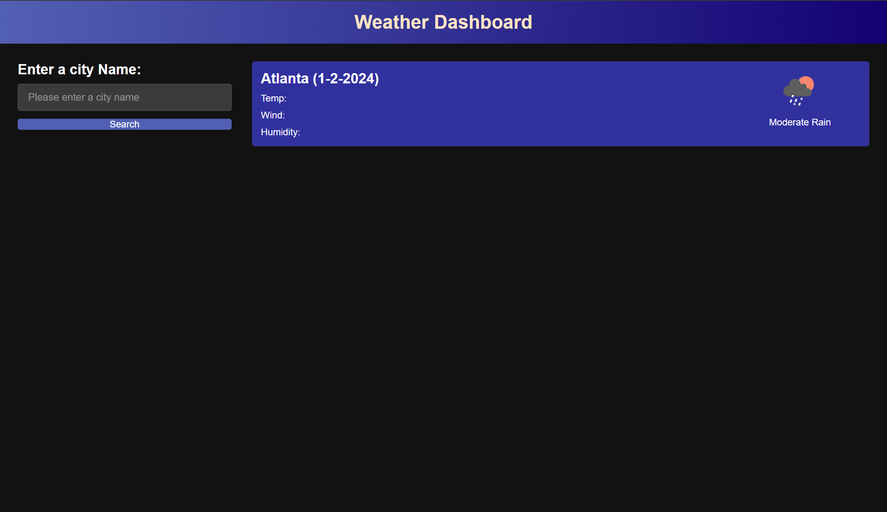

# Work Day Scheduler

## Description

In this project we created a weather dashboard application. We used a combination of HTML, CSS and Javascript to complete the challenge. This assignment allowed us to better our understanding of JQuery, which helped to create a more concise code in JS.
I enjoyed this challenge because I was able to experiment with different CSS styles and customize my dashboard. 

## Repository

Link to deployed code: https://wintino5.github.io/Weather_DashboardWJr/

## Technologies

- Written with JavaScript/JQuery HTML5 and CSS
- Follows SEO semantic structure

## License

MIT License

## Mock-Up

The following image shows the web application's functionality and appearance:

